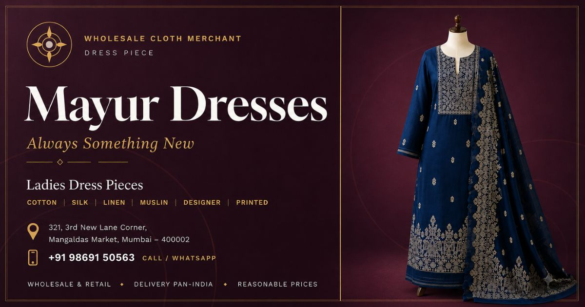

# 🧵 Mayur Dresses — Business Website


> 🛍️ **Client Project** — Local business website built for a wholesale & retail ladies dress-piece shop in Mumbai.

The official website of **Mayur Dresses**, a ladies dress-pieces shop and wholesale cloth merchant with over 15 years of trusted service in Mangaldas Market, Mumbai. Built with pure HTML, CSS and JavaScript — no frameworks, no build step — and deployed on Netlify with a custom domain, full local SEO, structured data, and a WhatsApp-first contact flow designed for how the shop actually does business.

Built by **[Grow on Internet](https://growoninternet.com)**.

---

## 🌐 Live Website

**[https://www.mayurdresses.in](https://www.mayurdresses.in)**

---

## 📸 Preview



---

## ✨ Features

- Sticky/solid-on-scroll navbar with mobile hamburger menu
- Infinite auto-scrolling fabric/category marquee
- Product **category cards** (Cotton, Silk, Linen, Muslin, Designer, Printed) — each with a one-tap **"Inquire" → WhatsApp** deep link, pre-filled with the category name
- "Why Choose Us" feature grid, customer testimonials, and a full **FAQ accordion** (single-open, native `<details>` with a JS fallback)
- **Visit Us** section with an embedded, verified Google Maps location
- **Inquiry form** that builds a message from Name / Phone / Category / Requirement and opens WhatsApp with it pre-filled — phone number required with 10-digit validation, no backend needed
- Persistent **floating WhatsApp button** across the whole site
- Scroll-reveal animations via `IntersectionObserver`, fully disabled under `prefers-reduced-motion`
- Custom on-brand **404 page** with quick links back home and to WhatsApp
- **Structured data (JSON-LD `@graph`)** — `ClothingStore`/`LocalBusiness`, `WebSite`, `WebPage`, `BreadcrumbList` & `FAQPage`, all cross-linked via `@id`
- Full **local SEO** — geo meta tags, NAP consistency across page/schema/footer, keyword-rich Mumbai/Mangaldas Market copy
- **AEO/GEO ready** — `llms.txt` plain-text business summary so AI assistants (ChatGPT, Perplexity, Claude) can answer questions about the shop accurately
- **PWA-installable** — full manifest + icon set (favicon, Apple touch icon, Android/maskable icons)
- Lazy-loaded images with descriptive alt text on every photo, zero layout shift
- Production security headers & long-cache asset rules via Netlify

---

## 🛠️ Tech Stack

| Technology | Usage |
|---|---|
| HTML5 | Semantic structure, SEO meta tags, Open Graph, JSON-LD |
| CSS3 | Custom properties, Grid, Flexbox, scroll-reveal animation, `prefers-reduced-motion` |
| JavaScript (ES6+) | Navbar, marquee, FAQ accordion, inquiry form, WhatsApp deep-linking |
| Google Fonts | Fraunces (serif, display) + Manrope (sans, body) |
| Netlify | Hosting, custom domain, redirects, security headers, caching |
| `netlify.toml` | Header rules, cache config, custom 404 |

---

## 🧠 JavaScript Features

- `IntersectionObserver` — scroll-reveal animations for sections and cards
- FAQ accordion — single-open behaviour with a fallback for browsers without native `details[name]` support
- Mobile menu toggle (hamburger open/close)
- Category "Inquire" links — build a category-specific pre-filled WhatsApp message via `encodeURIComponent`
- Inquiry form — validates a 10-digit phone number, then builds and opens a full pre-filled WhatsApp message from all filled fields
- `window.open` hand-off to `wa.me` for every WhatsApp touchpoint (hero, about, collection, floating button, footer, contact form)

---

## 🔍 SEO & Performance

- **JSON-LD structured data** — `ClothingStore`/`LocalBusiness` (with hours, geo, catalogue & contact), `WebSite`, `WebPage`, `BreadcrumbList`, `FAQPage`
- `sitemap.xml` — includes an image sitemap for all product category photos, ready to submit to Google Search Console
- `robots.txt` — allows all crawlers and major AI crawlers (GPTBot, PerplexityBot, ClaudeBot, Google-Extended), points to the sitemap
- Open Graph + Twitter Card meta — rich previews on WhatsApp, LinkedIn & X
- Custom `og-image.jpg` (1200×630) for link previews
- Hero image preloaded with `fetchpriority="high"`; below-the-fold images `loading="lazy"`
- Full favicon + PWA icon set, including maskable icons for Android
- Long-cache headers for images/icons via `netlify.toml`

---

## 🔒 Security Headers (via Netlify)

```
Strict-Transport-Security: max-age=31536000; includeSubDomains; preload
X-Content-Type-Options: nosniff
X-Frame-Options: SAMEORIGIN
Referrer-Policy: strict-origin-when-cross-origin
Permissions-Policy: geolocation=(), microphone=(), camera=()
```

HTML is served with `Cache-Control: public, max-age=0, must-revalidate` (always fresh); images and icons (`.jpg`, `.png`, `.svg`, `.ico`) are cached for 30 days.

---

## 🗺️ Key Sections

| Section | Purpose |
|---|---|
| **Hero** | Headline, trust signals, primary "View Collection" CTA |
| **About Us** | 15+ years of trust, shop story |
| **Collection** | Cotton, Silk, Linen, Muslin, Designer, Printed — each inquire-able on WhatsApp |
| **Why Us** | Variety, pricing, delivery, wholesale & retail |
| **Reviews** | Customer testimonials |
| **Visit Us** | Address, hours, embedded map, contact person |
| **FAQ** | Local-SEO-targeted questions about location, wholesale, delivery, timings |
| **Get In Touch** | WhatsApp / Call CTAs + pre-filled inquiry form |

---

## 📁 Project Structure

```
mayurdresses/
├── index.html              # Main page (HTML + CSS + JS in one file)
├── 404.html                 # Custom not-found page
├── sitemap.xml               # SEO sitemap (incl. image sitemap)
├── robots.txt                 # Crawler rules + sitemap reference
├── llms.txt                    # Plain-text business summary for AI assistants
├── site.webmanifest             # PWA manifest (icons, theme colour)
├── netlify.toml                  # Hosting config: security headers, caching, 404
├── .gitignore
├── favicon.ico / favicon.svg      # Compass-medallion favicons
├── favicon-16.png / favicon-32.png / favicon-48.png
├── apple-touch-icon.png            # iOS home-screen icon (180×180)
├── icon-192.png / icon-512.png / icon-192-maskable.png   # PWA / Android icons
├── logo.svg / logo.png              # Brand logo — medallion + wordmark
├── og-image.jpg                      # Social share image (1200×630)
├── img/                                # Hero, about & category product photos
└── README.md
```

All files sit in a **flat structure** — `index.html` references images and icons by root-relative paths (`/favicon.ico`, `img/hero1_jpg.jpg`, etc.).

---

## 🚀 Deployment

Deployed on **Netlify** with a custom domain, DNS pointed from Hostinger.

```
Live URL:  https://www.mayurdresses.in
Platform:  Netlify
Domain:    mayurdresses.in (custom, via Hostinger DNS)
Primary:   www.mayurdresses.in
Publish:   . (site root, no build step)
```

### Pre-launch checklist
- [x] Domain live, DNS pointed to Netlify, HTTPS forced
- [x] Map pin / geo coordinates confirmed against the verified Google Business Profile
- [ ] Replace `G-XXXXXXXXXX` in `index.html` with the real GA4 Measurement ID
- [ ] Replace `REPLACE_WITH_SEARCH_CONSOLE_TOKEN` in `index.html` with the real Search Console verification token
- [ ] Submit `sitemap.xml` in Google Search Console after going live

---

## 📞 Contact

**Mayur Dresses** — Ladies Dress Pieces & Wholesale Cloth Merchant
📍 321, 3rd New Lane Corner, Mangaldas Market, Mumbai – 400002
💬 WhatsApp / Call: +91 98691 50563 (Pratik Jain)
🕒 Mon–Sat, 10:00 AM – 9:00 PM
🌐 [mayurdresses.in](https://www.mayurdresses.in)

---

## 👩‍💻 Built By

**Jinal Jain** — Freelance Frontend Developer & SEO Specialist, [Grow on Internet](https://growoninternet.com)
- GitHub: [@jinaljain733-cmd](https://github.com/jinaljain733-cmd)

---

## 📄 License

© 2026 Mayur Dresses. All rights reserved.

> This is a commissioned business website. The code and design are proprietary to Mayur Dresses and may not be reused, copied or redistributed without written permission.
